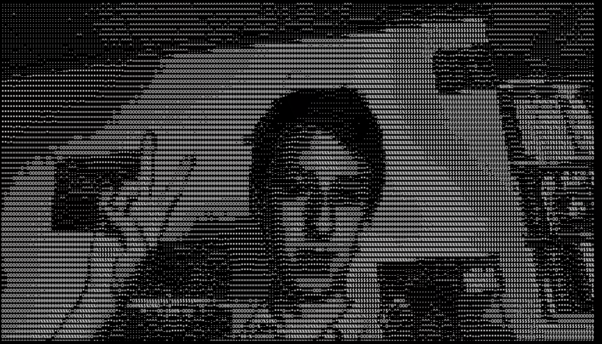

# Python Text Camera

# Functionality

This program uses dithering to create images out of letters.
First it compresses an image to fit to the characters.
Then it turns the image to grayscale.
Then it checks the value of each pixel and converts it to letters.

# Setup

You have to install:
* `open-cv`
* `PySimpleGUI`